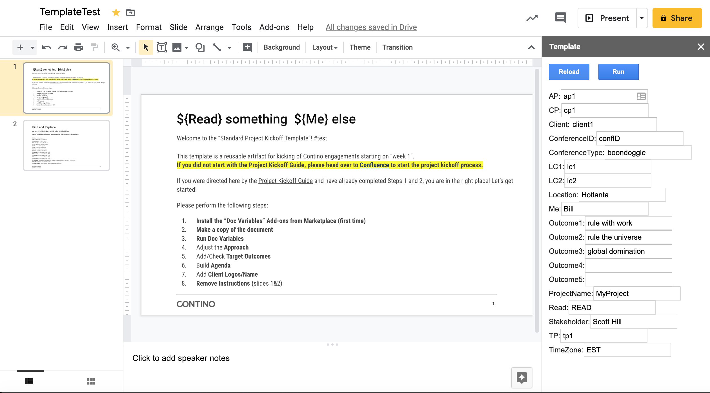

# SlideTemplate
Google Slide Add-on to templatize the slide, replacing ${} variables with values from a sidebar form.

Complete the steps described in the rest of this page, and in about five minutes you'll have created a Google Slides add-on that templatizes your presentation.

## Set it up
* Your presentation should have ${XXX} strings.  Create a new Google Presentation and add some or use an existing presentation that has some.
* From within your new presentation, select the menu item Tools > Script editor. If you are presented with a welcome screen, click Blank Project.
* Delete any code in the script editor and rename Code.gs to template.gs.
* Create a new file by selecting the menu item File > New > HTML file. Name this file sidebar (Apps Script adds the .html extension automatically).
* Replace any code in these two files with the following content, respectively:
[template.gs](template.gs)
[sidebar.html](sidebar.html)
* **Disable New Apps Script Runtime powered by Chrome V8**
* Select the menu item File > Save all. Name your new script "SlideTemplate" and click OK. The script's name is shown to end users in several places, including the authorization dialog.

## Try it out
* Switch back to your presentation and reload the page.
* After a few seconds, a SlideTemplate sub-menu appears under the Add-ons menu. 
* Click Add-ons > **SlideTemplate** > Open.
* A dialog box indicates that the script requires authorization. Click Continue. A second dialog box requests authorization for specific Google services. Click Allow. This step needs to be done once.
* A sidebar appears. 
* Click the **Reload** button. 
* Fill in the desired value for each ${} Variable. 
* To replace the text in the presentation, click **Run**.

## Publish
If Published it is shared with the world.  That is not done yet.

## Templates
* [TestTemplate](https://docs.google.com/presentation/d/1fqtCE8iTxzaf1ZgcICB_qb4cjEaFoOuXnj9xG6PlMH8/edit#slide=id.g5e5b0c9b58_0_1)
* [Standard Project Kickoff](https://docs.google.com/presentation/d/1bb_Dw5Hyvb8POGhNyoLSxw9dIwKMgKsv7CUBFJarf8s)
* [Data Strategy Pitch Template](https://docs.google.com/presentation/d/1LYlnNRtLgAOS29H29M5cUGtHKIVFtpKJsvPIzQzQi0U/edit#slide=id.g7ebd95ecfd_0_316)

## Learn more
* [Apps Script Slides API](https://developers.google.com/apps-script/reference/slides)
* [Translate](https://developers.google.com/apps-script/guides/slides/samples/translate)
* https://developers.google.com/gsuite/add-ons/editors/slides/quickstart/translate
* [Doc Variables](http://docvariables.com/) is similar, but no source
* https://docs.google.com/presentation/d/1bb_Dw5Hyvb8POGhNyoLSxw9dIwKMgKsv7CUBFJarf8s/edit#slide=id.g5e5b0c9b58_0_1
* https://developers.google.com/gsuite/add-ons/editors/slides
* https://codelabs.developers.google.com/codelabs/apps-script-intro/#6
* https://groups.google.com/forum/?utm_medium=email&utm_source=footer#!forum/doc-variables----support-and-requests
* https://zapier.com/apps/google-sheets/integrations/miro
* https://github.com/gsuitedevs/apps-script-samples
